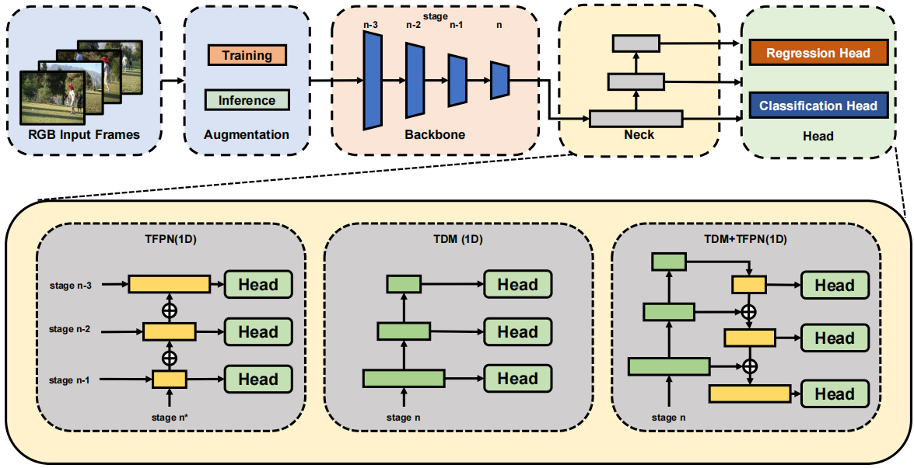

# BasicTAD

[](https://paperswithcode.com/sota/temporal-action-localization-on-thumos14?p=basictad-an-astounding-rgb-only-baseline-for)

Our paper is available in [BasicTAD](https://arxiv.org/abs/2205.02717) 

# News
[2023.5.4] New code is updated in "new" branch.
[2023.4.13] Our BasicTAD has been published in CVIU. New code will be updated soon. <br>
[2022.11.14] We upload pretrained backbone for users to train their own models. <br>
[2022.11.2] Some issues have been fixed. More complete code is on the way. <br>
[2022.9.1] We update README.md, and release codes, checkpoint on THUMOS14.



# Overview

This paper is empirical study on end-to-end TAD pipeline. Here we release our code here for further study of the TAD task. We hope to contribute to the development of the TAD community.

# Environment preparation

## Create environment
```
conda create -n basictad python=3.8
``` 
## Activate environment
```
conda activate basictad
``` 
## Install pytorch (take cuda==10.2 as example)
```
conda install pytorch==1.8.1 torchvision==0.9.1 torchaudio==0.8.1 cudatoolkit=10.2 -c pytorch
``` 
## Install mmcv (take mmcv-full==1.4 as example)
```
pip install mmcv-full==1.4 -f https://download.openmmlab.com/mmcv/dist/cu102/torch1.8.0/index.html
``` 
## Clone the basictad repository.
```
git clone https://github.com/MCG-NJU/BasicTAD.git
cd BasicTAD
``` 
## Install basictad and other dependencies
``` 
pip install -r requirements/build.txt
pip install -v -e .
``` 
# Data preparation

## Thumos14
1: Download datasets
```
cd ${basictad_root}/data/thumos14
bash download.sh
```
2: Extract frames
```
cd ${basictad_root}/data/thumos14
#3fps:
bash extract_frames.sh videos/val frames_3fps/validation -vf fps=3 %05d.jpg
bash extract_frames.sh videos/test frames_3fps/test -vf fps=3 %05d.jpg
#6fps:
bash extract_frames.sh videos/val frames_6fps/validation -vf fps=6 %05d.jpg
bash extract_frames.sh videos/test frames_6fps/test -vf fps=6 %05d.jpg
```

3: We upload two files in this [link](https://pan.baidu.com/s/15Grt6eBEfJEBQV1FaQutUg)(key:cjsk) as pretained backbone SlowOnly. 
Put SLOW_8x8_R50.pyth into ～/.cache/toch/hub/checkpoints. Unzip facebookresearch_pytorchvideo_master.zip into ～/.cache/toch/hub

# Train and test
```
cd ${basictad_root}
#anchor-free-3fps
bash tools/thumos/train_and_test_thumos_anchor_free_3fps.sh
#anchor-free-6fps
bash tools/thumos/train_and_test_thumos_anchor_free_6fps.sh
#anchor-based-3fps
bash tools/thumos/train_and_test_thumos_anchor_based_3fps.sh
#anchor-based-6fps
bash tools/thumos/train_and_test_thumos_anchor_based_6fps.sh
```
# Checkpoint
|Method|mAP@0.3|mAP@0.4|mAP@0.5|mAP@0.6|mAP@0.7|Avg|checkpoint|
|----  | ----  |----  | ----  |----  | ----  |----  |----  |
|anchor_based_6fps|72.3|68.4|62.0|52.4|37.0|58.4|[link](https://pan.baidu.com/s/1-lIXLGytXTKvcR6uEruVng)(key:z509)
|anchor_free_6fps|75.1|70.2|63.0|50.6|38.7|59.5|[link](https://pan.baidu.com/s/1Q52A9O1cHKM9Cp8cbX2hdQ)(key:kkn3)

# How to use Checkpoints above
```
cd ${basictad_root}
# anchor_based_6fps
CUDA_VISIBLE_DEVICES=0 python tools/thumos/test_ab.py configs/trainval/basictad/thumos14/basictad_slowonly_e700_thumos14_rgb_192win_anchor_based.py anchor_based-6fps/epoch_300_epoch.pth
# anchor_free_6fps
CUDA_VISIBLE_DEVICES=0 python tools/thumos/test_af.py --framerate 6 configs/trainval/basictad/thumos14/basictad_slowonly_e700_thumos14_rgb_192win_anchor_free.py anchor_free-6fps/epoch_600_epoch.pth
```
# Credits
We especially thank the contributors of the [DaoTAD](https://github.com/Media-Smart/vedatad) for providing helpful code.


